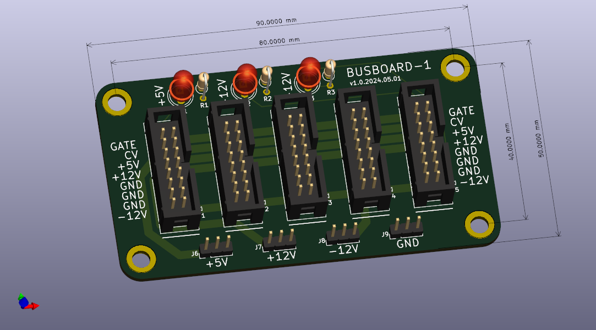

# eurorack-busboard
Simple passive bus board for power distribution

There are many good examples of these out there already, e.g. (David Haillant's)[http://www.davidhaillant.com/category/electronic-projects/eurorack-power-bus/compact-16-pin-eurorack-power-bus-board/]. Probably better to just use those, but this project will also be an effort to create a CI/CD process for hardware captured in KiCAD. 

